# 🏛️ Insurance Policy EDA Prototype

> **Event-Driven Architecture for Real-Time Insurance Policy Management**

---

## Overview

This project is a modular, scalable, and maintainable prototype for insurance policy management, built on an Event-Driven Architecture (EDA) using **RabbitMQ**, **PostgreSQL 18.1**, and **Java WebFlux**. It demonstrates:

- **Current state persistence**
- **Complete event traceability**
- **State replayability**
- **Reactive APIs for real-time updates and event streaming**

---

## ✨ Features

- **Event Sourcing**: All changes to policies are captured as immutable events.
- **Reactive APIs**: Built with Java WebFlux for non-blocking, real-time data access and event streaming.
- **RabbitMQ Integration**: Decoupled event messaging for scalable, asynchronous processing.
- **PostgreSQL Persistence**: Reliable storage for both event history and current state.
- **Replay & Traceability**: Rebuild state or audit any policy from its event log.

---

## 🛠️ Architecture

```mermaid
flowchart TD
    UI[User/API Client] -->|REST/Reactive| WebFlux[Java WebFlux API]
    WebFlux -->|Publish Event| RabbitMQ[🐇 RabbitMQ]
    RabbitMQ -->|Consume Event| EventListener[Reactive Event Listener]
    EventListener -->|Persist| Postgres[(PostgreSQL 18.1)]
    WebFlux -->|Query| Postgres
    WebFlux -->|Stream Events| RabbitMQ
```



- **WebFlux API**: Exposes endpoints for policy commands, queries, and event streaming.
- **RabbitMQ**: Handles event distribution and decouples producers/consumers.
- **Event Listener**: Consumes events, updates current state, and persists event history.
- **PostgreSQL**: Stores both the current state and the full event log.

---

## 🚀 Getting Started

### Prerequisites
- Java 17+
- PostgreSQL 18.1 (with `uuid-ossp` extension enabled)
- RabbitMQ (with default or custom credentials)
- Gradle

### Setup

1. **Clone the repository**
2. **Configure your environment**
   - Edit `src/main/resources/application.yaml` with your PostgreSQL and RabbitMQ credentials.
3. **Create the required tables in PostgreSQL:**

   ```sql
   CREATE EXTENSION IF NOT EXISTS "uuid-ossp";
   CREATE TABLE public.poliza_evento (
     id uuid PRIMARY KEY DEFAULT uuid_generate_v4(),
     id_poliza varchar(255) NULL,
     extra_data varchar(255) NULL
   );
   CREATE TABLE public.poliza_estado_actual (
     id_poliza varchar(255) PRIMARY KEY,
     estado varchar(255) NULL
   );
   ```
4. **Build and run the project:**
   ```sh
   ./gradlew bootRun
   ```

---

## 📚 Usage

- **Create/Update Policy**: Send a POST/PUT to the API to emit a new event.
- **Get Current State**: Query the API for the latest state of a policy.
- **Get Event Trace**: Retrieve the full event history for a policy.
- **Stream Events**: Subscribe to real-time event streams via the API.

> [!TIP]
> All API endpoints are reactive and support real-time data streaming.

---

## 🧩 Project Structure

```
├── src/main/java/com/softcaribbean/demo/rabbit/
│   ├── Application.java                # Main Spring Boot app
│   ├── config/                        # RabbitMQ & DB config
│   ├── controllers/                   # Reactive REST controllers
│   ├── domain/dtos/                   # DTOs for events and responses
│   ├── domain/entities/               # JPA/R2DBC entities
│   ├── gateway/                       # RabbitMQ event gateway
│   ├── repository/                    # R2DBC repositories
│   └── service/                       # Event listeners and business logic
├── src/main/resources/application.yaml # Main configuration
├── build.gradle                       # Gradle build file
└── docker-compose.yml                 # (Optional) for local RabbitMQ/Postgres
```

---

## 📝 References & Inspiration
- [Spring WebFlux](https://docs.spring.io/spring-framework/docs/current/reference/html/web-reactive.html)
- [R2DBC Postgres](https://r2dbc.io/)
- [RabbitMQ](https://www.rabbitmq.com/)
- [Event Sourcing Pattern](https://martinfowler.com/eaaDev/EventSourcing.html)

> [!NOTE]
> This project is a prototype and a reference for building robust, event-driven insurance systems with modern Java and cloud-native tools.

